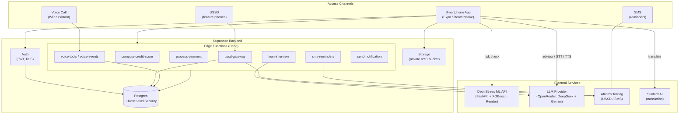
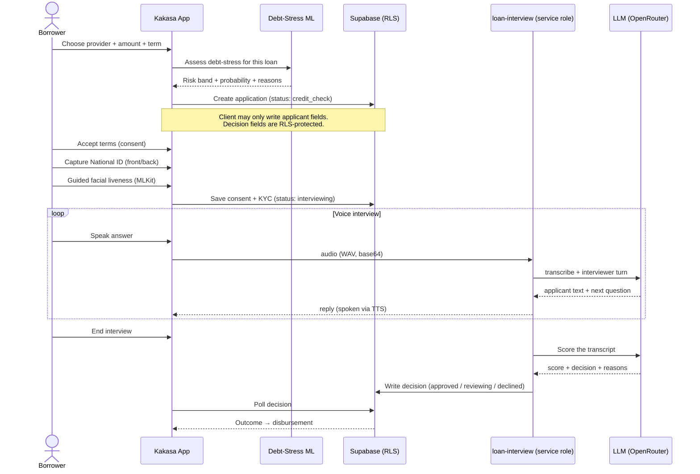
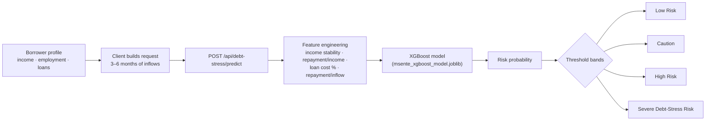
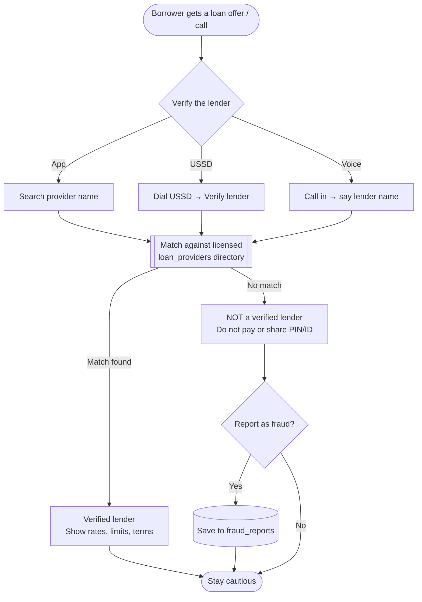
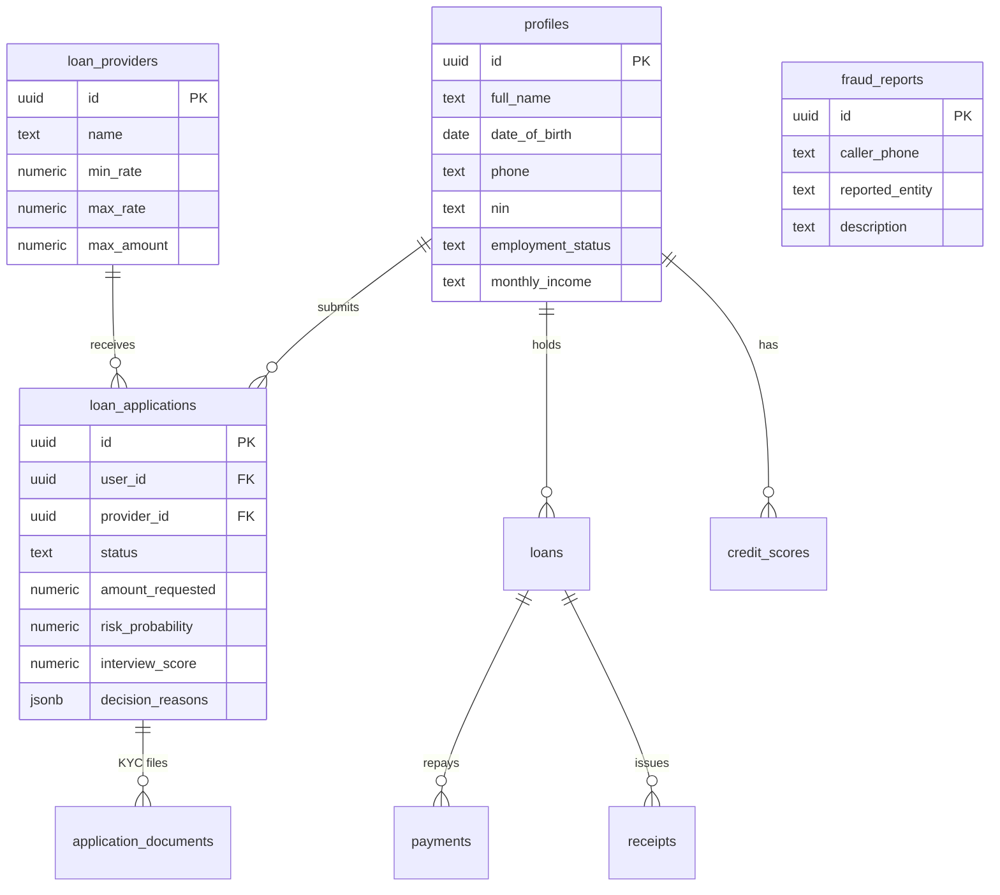

<div align="center">

# Kakasa

### Borrow with confidence. Verify before you trust.

**A borrower-protection platform that shields Ugandans from unsolicited, high-cost digital loans - and helps them borrow responsibly when they choose to.**

Reachable on a smartphone, a feature phone (USSD), a phone call (voice), and by SMS - so protection reaches everyone, not just people with data.

<br/>

🏆 **1st Runner-Up - Bank of Uganda @60 Hackathon**
Selected among **1,069 applicants**

Built by **Jude Otine · Grace · William Benjamin · Conrad Wagabi · Catherine Ndagire**

<br/>


</div>

---

## Table of Contents

- [The Problem](#-the-problem)
- [The Solution](#-the-solution)
- [Feature Tour](#-feature-tour)
- [System Architecture](#-system-architecture)
- [The Loan Journey](#-the-loan-journey)
- [Debt-Stress ML Model](#-debt-stress-ml-model)
- [Fraud Protection & Lender Verification](#-fraud-protection--lender-verification)
- [Data Model](#-data-model)
- [Tech Stack](#-tech-stack)
- [Repository Structure](#-repository-structure)
- [Getting Started](#-getting-started)
- [Environment Variables](#-environment-variables)
- [Edge Functions](#-edge-functions)
- [Security](#-security)
- [The Team](#-the-team)

---

## The Problem

Uganda's digital-lending boom has a dark side. Every day, borrowers are hit with **unsolicited SMS and calls from unlicensed "loan apps"** charging punishing interest, harvesting contacts, and shaming defaulters. Many people:

- **Can't tell a licensed lender from a scam** before they hand over their National ID and mobile-money PIN.
- **Over-borrow**, because no one shows them what a loan will actually cost them month-to-month.
- **Have no safe way to report** a predatory lender or a fraudulent call.
- **Are excluded** from protection tools because they don't own a smartphone or have mobile data.

## The Solution

**Kakasa** ("verify" / "prove it") puts a protective layer between the borrower and the lender:

| Pillar | What it does |
| --- | --- |
| **Verify** | Instantly check whether a lender is a **licensed, known provider** before engaging - by app, USSD, or voice call. |
| **Report** | One-tap / one-call **fraud reporting** for scam lenders and predatory calls. |
| **Warn** | An **XGBoost debt-stress model** estimates whether a proposed loan will strain a borrower's finances - *before* they commit. It advises; it never silently approves or rejects. |
| **Advise** | A multilingual **AI financial advisor** for credit, budgeting, and loan literacy. |
| **Borrow safely** | A guided application flow with **KYC, liveness, and an AI interview** - only through vetted providers. |
| **Reach everyone** | The same protection on **smartphone, USSD, voice, and SMS**, in **local languages**. |

---

## Feature Tour

### Protection & Trust
- **Lender verification** - search any lender name and get a clear verdict (verified provider vs. "not on Kakasa - be cautious"), via app, USSD, or voice.
- **Fraud reporting** - report predatory lenders / scam calls; reports are captured for follow-up (`fraud_reports`).
- **Debt-stress risk assessment** - a per-loan risk band (`Low Risk · Caution · High Risk · Severe Debt-Stress Risk`) from the ML service.

### Borrowing
- **Licensed provider directory** - curated Uganda-licensed digital lenders with rates, limits, terms, and requirements.
- **Personalized credit score** - a 300–850 rule-based scorecard computed from onboarding data and loan history.
- **Guided loan application** - choose an amount → debt-stress check → consent & KYC → AI voice interview → decision → disbursement.
- **KYC & liveness** - National ID front/back capture and a guided facial-liveness check (on-device MLKit face detection).
- **AI voice interview** - a conversational loan-officer interview (speech-to-text → LLM → text-to-speech) that scores the applicant.

### Money
- **Disbursements, repayments, payments & receipts** - track active loans, pay, and download receipts.
- **SMS reminders** - repayment nudges over Africa's Talking.
- **Push notifications** - loan and credit-score updates.

### Access & Inclusion
- **USSD companion** - a full feature-phone journey (PIN-protected): verify a lender, get financial tips, and more.
- **Voice assistant** - call in to verify a lender or report fraud, hands-free.
- **Multilingual UI** - in-app translation into Ugandan languages via Sunbird AI.
- **Biometric unlock** - Face ID / fingerprint via the device secure enclave.

---

## System Architecture

Kakasa is **multi-channel by design** - every channel funnels into one trusted backend, so a feature-phone user and a smartphone user get the same verified answers.



---

## The Loan Journey

The application flow is deliberately staged so a borrower **understands the cost and risk before committing**, and so decision-making stays server-side (a client can never approve its own loan).



**Why this matters:** the debt-stress warning is shown **first**, KYC images go to a **private bucket** with owner-scoped access, and the **only writer of decision fields is the service-role edge function** - enforced by Row Level Security.

---

## Debt-Stress ML Model

A first-party **XGBoost** model, served as a FastAPI microservice on Render. It answers one question: *"Is this loan likely to cause this borrower debt stress?"* - and returns a human-readable band. **It does not approve or reject loans.**



- **Endpoints:** `GET /health`, `POST /api/debt-stress/predict`
- **Engineered features:** `income_stability_score`, `repayment_to_income_ratio`, `loan_cost_percentage`, `repayment_to_inflow_ratio`, `avg_monthly_inflow`
- **Deployment:** Render (Python 3.11.9 pinned); the model is loaded once at startup with `joblib`
- **Safety:** the model artifact is a trusted first-party file - never load a pickle/joblib from an untrusted source

See [`ml-service/README.md`](ml-service/README.md) for the full request/response contract.

---

## Fraud Protection & Lender Verification

The anti-scam heart of Kakasa - available to **anyone with a phone**, no app or data required.



USSD and voice run through Supabase Edge Functions (`ussd-gateway`, `voice-tools`, `voice-events`) with **PBKDF2-hashed PINs**, constant-time comparisons, and session logging (`voice_sessions`).

---

## Data Model

Core tables (all protected by Row Level Security):



---

## Tech Stack

| Layer | Technologies |
| --- | --- |
| **Mobile app** | Expo SDK 57 · React Native 0.86 · React 19 · expo-router (typed routes, native tabs) · Reanimated · react-native-svg |
| **Backend** | Supabase - Postgres, Auth (JWT), Row Level Security, Storage, Edge Functions (Deno/TypeScript) |
| **ML service** | Python · FastAPI · XGBoost · scikit-learn · pandas/numpy · deployed on Render |
| **AI** | OpenRouter - DeepSeek (chat/interview/scoring) + Gemini (speech-to-text) · on-device TTS (expo-speech) |
| **KYC / liveness** | expo-camera · expo-image-picker · `@react-native-ml-kit/face-detection` |
| **Telco** | Africa's Talking (USSD + SMS) · voice IVR assistant |
| **Localization** | Sunbird AI translation · custom i18n layer |
| **Security** | RLS policies · PBKDF2 PIN hashing · private KYC storage · biometric unlock (expo-local-authentication) |

---

## Repository Structure

```
kakasa/
├── app/                        # Expo Router screens (file-based routing)
│   ├── (tabs)/                 # Home, Loans, Providers, Advisor, Profile
│   ├── auth/                   # Login, signup, forgot-password
│   ├── loan-apply/             # amount → risk → consent → interview → decision
│   ├── loan/                   # Loan detail, pay, receipt
│   ├── onboarding.tsx          # First-run onboarding
│   └── account-setup.tsx       # Profile, phone OTP, biometrics, notifications
├── components/                 # Reusable UI (consent/, credit/, loans/, providers/)
├── lib/                        # Data layer & services
│   ├── supabase.ts             # Client
│   ├── credit.ts / providers.ts / loanApplication.ts
│   ├── debtStress.ts           # ML risk-check client
│   ├── i18n.tsx / strings.ts / sunbird.ts   # Localization
│   └── translations/
├── supabase/
│   ├── migrations/             # Versioned SQL schema (RLS, tables, seeds)
│   └── functions/              # Deno edge functions
│       ├── _shared/            # africastalking, creditScorecard, admin client
│       ├── compute-credit-score/
│       ├── loan-interview/
│       ├── ussd-gateway/       # Feature-phone journey
│       ├── voice-tools/  voice-events/   # Voice assistant + fraud tools
│       ├── process-payment/  send-notification/  sms-reminders/
└── ml-service/                 # FastAPI debt-stress model (Render)
    ├── app/                    # main.py, model_service.py, risk.py, schemas.py
    ├── models/                 # msente_xgboost_model.joblib
    └── requirements.txt
```

---

## Getting Started

### Prerequisites
- **Node.js** 20+ and **Yarn** (this project uses Yarn - not npm)
- **Xcode** (iOS) / **Android Studio** (Android) - a **dev client** is required (the app uses native modules: camera, audio, MLKit, date picker)
- **Python** 3.11 (for the ML service)
- A **Supabase** project and an **OpenRouter** API key

### 1. Install & configure
```bash
git clone <repo-url> kakasa && cd kakasa
yarn install
cp .env.example .env.local   # then fill in the values below
```

### 2. Run the mobile app
```bash
yarn ios        # build & run on iOS simulator/device (dev client)
yarn android    # build & run on Android
# yarn dev      # start the Metro bundler
```
> The app depends on native modules, so it runs in a **custom dev client**, not Expo Go. If you add/upgrade native deps, run `yarn expo prebuild --clean` and rebuild.

### 3. Run the ML service (optional, for local risk checks)
```bash
cd ml-service
python -m venv .venv && source .venv/bin/activate
pip install -r requirements.txt
uvicorn app.main:app --reload --port 8000
# point EXPO_PUBLIC_ML_API_URL at http://localhost:8000
```

### 4. Supabase
Apply the SQL in `supabase/migrations/` (in order) and deploy the functions in `supabase/functions/` to your project. Set the function secrets listed below.

---

## Environment Variables

**App (`.env.local` - `EXPO_PUBLIC_*` values are bundled into the client):**

| Variable | Purpose |
| --- | --- |
| `EXPO_PUBLIC_SUPABASE_URL` | Supabase project URL |
| `EXPO_PUBLIC_SUPABASE_ANON_KEY` | Supabase anon key |
| `EXPO_PUBLIC_ML_API_URL` | Base URL of the debt-stress ML service |
| `EXPO_PUBLIC_SUNBIRD_API_KEY` | Sunbird AI translation key |

**Server (Supabase Edge Function secrets - never shipped to the client):**

| Variable | Purpose |
| --- | --- |
| `SUPABASE_SERVICE_ROLE_KEY` | Privileged DB access for decision writes |
| `OPENROUTER_API_KEY` | LLM (advisor, interview, STT, scoring) |
| `AT_API_KEY` / `AT_USERNAME` | Africa's Talking (USSD & SMS) |

---

## Edge Functions

| Function | Responsibility |
| --- | --- |
| `compute-credit-score` | Rule-based 300–850 scorecard from profile + loan history |
| `loan-interview` | Voice interview: transcription, interviewer turns, and **decision scoring** (only writer of decision fields) |
| `ussd-gateway` | Full feature-phone journey (Africa's Talking) - PIN-protected, multilingual, lender verification, tips |
| `voice-tools` / `voice-events` | Voice IVR: verify a lender, report fraud, log sessions |
| `process-payment` | Loan repayments and receipts |
| `sms-reminders` | Repayment reminders over SMS |
| `send-notification` | Push notifications |

---

## Security

- **Row Level Security everywhere.** Applicants can read/write only their own rows; the split policy on `loan_applications` lets a client set applicant fields and safe status transitions, but **only the service-role edge function can write decision fields** (score, approval, reasons) - a client can never self-approve.
- **KYC images** (National ID + face frames) live in a **private storage bucket**, path-scoped to the owner.
- **USSD PINs** are hashed with **PBKDF2 (100k iterations, SHA-256)** and compared in constant time; account takeover via re-registration is blocked.
- **PINs are redacted** from USSD session audit logs.
- **Biometric unlock** uses the device secure enclave (Face ID / fingerprint).

---

## The Team

Built for the **Bank of Uganda @60 Hackathon**, where Kakasa was selected as **1st Runner-Up among 1,069 applicants**.

| Member |
| --- |
| **Jude Otine** |
| **Grace Wanja** |
| **William Benjamin** |
| **Conrad Wagabi** |
| **Catherine Ndagire** |

<div align="center">

---
**Kakasa - verify before you trust.**

</div>
